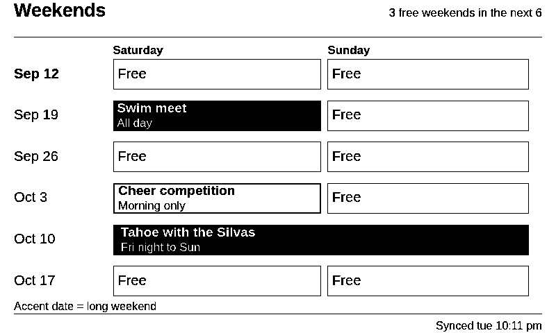
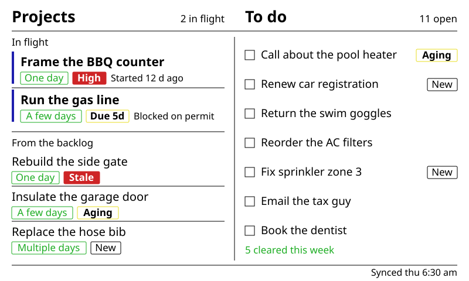
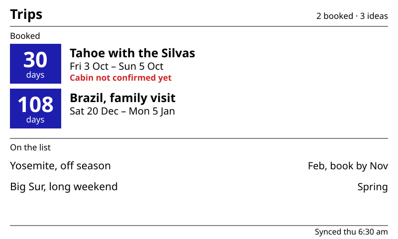
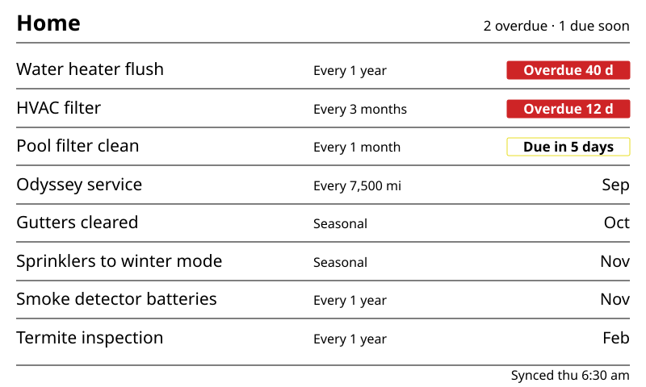
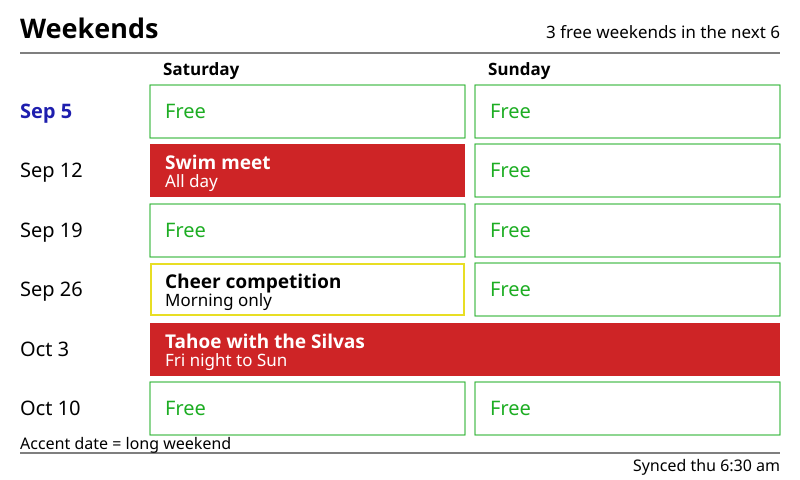
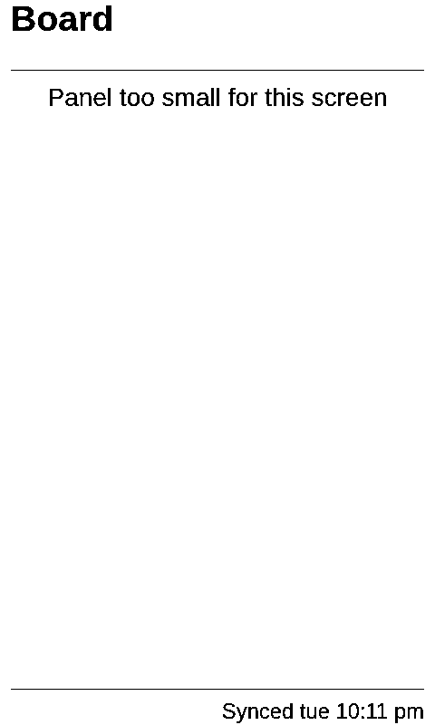

# Homeboard Screens

The four dashboard screens this fork adds — **Board**, **Trips**, **Home**, and **Weekends** —
are not general-purpose InkyPi plugins. They are one product: a bedroom e-ink panel that answers
household questions at a glance, without anyone opening an app.

This document covers what each screen is *for* and what it *looks like*. For how they are wired
into the refresh loop, see [Architecture](./architecture.md); for the plugin API itself, see
[Building Plugins](./building_plugins.md).

> **About the images.** The four screen illustrations are SVG mockups, adapted from the original
> design mockups in `specs/`. Their **composition** — geometry, proportions, sample content — is the
> design's; their **content vocabulary and colour** is the shipped code's, so the chip labels,
> header meta, footer and palette values match what a panel renders today rather than what the
> design first proposed. Where the two disagree, see
> [Design intent vs. what ships](#design-intent-vs-what-ships).
>
> Two images are not mockups but live renders, because they're evidence about real behaviour rather
> than illustrations of intent: the black-and-white palette collapse and the panel-too-small
> fallback. Both come from `scripts/render_homeboard_mocks.py`, which drives the actual plugins
> against fixture data — no `boardbot` deployment, no calendar feeds, no Pi. That script is also the
> quickest way to see a change to any screen without deploying to a panel:
>
> ```bash
> .venv/bin/python scripts/render_homeboard_mocks.py   # → runtime/homeboard_renders/
> ```

---

## The premise

A 7.3" e-ink panel on the bedroom wall, refreshed on a playlist. No touch, no backlight, no
notifications. Whatever it shows has to be readable from across the room, correct at a glance,
and worth the wall space when nothing has changed.

That constraint drives every design decision below:

- **Reading, not interacting.** Nothing is tappable. A screen's job is to answer a question
  ("is next weekend free?", "what's overdue?") in the two seconds someone looks at it while
  walking past.
- **Absence is information.** A quiet screen means nothing needs attention. Free time renders as
  whitespace; an item with no urgency carries no chip at all. Nothing is padded with placeholders
  to fill space.
- **Colour is a second signal, never the only one.** The same markup renders on a six-colour
  Spectra 6 panel and on black-and-white, where every accent collapses to black. Anything that
  means something in colour also means it in weight, fill, outline, or wording.
- **Capture happens elsewhere.** Items arrive by WhatsApp (via `boardbot`) or from calendars the
  household already keeps. The panel is a display surface, not a data-entry surface.

| Screen | Answers | Source |
|---|---|---|
| **Board** | What am I working on, and what still needs doing? | `boardbot` — `GET /projects`, `GET /todo` |
| **Trips** | How soon is the next trip, and what's blocking it? | `boardbot` — `GET /trips` |
| **Home** | What household maintenance is overdue or coming up? | `boardbot` — `GET /maintenance` |
| **Weekends** | Which of the next six weekends are actually free? | ICS calendar feeds over HTTP |

---

## The shared visual identity

All four screens are built from one toolkit in `src/homeboard/` — a shared palette, layout token
system, header/footer chrome, and tag vocabulary. The result is that they read as one board with
four faces rather than four unrelated plugins that happen to share a wall.

### Palette: six roles, not six colours

Screens are authored against semantic roles (`src/homeboard/palette.py`), and the roles resolve
against whatever panel is actually attached.

| Role | Six-colour panel | B&W panel | Means |
|---|---|---|---|
| `ink` | black | black | Text, rules, structure |
| `paper` | white | white | Background, text on solid fills |
| `available` | green `#1DAD23` | black | Free, cleared, sized — good news |
| `warn` | yellow `#E8DE24` | black | Approaching, due soon, partly booked |
| `alert` | red `#CE2426` | black | Overdue, booked, blocking |
| `emphasis` | blue `#1E1EAE` | black | Countdowns, in-flight markers, long weekends |

The six-colour values are the Inky Spectra 6 driver's own ink colours blended at this project's
default saturation — not an on-monitor guess. E-ink reds and greens read duller than a screen
mockup suggests, and the palette is pinned to what the panel physically produces.

Because every accent flattens to black on a B&W panel, colour never carries meaning alone:

- Blocking trip actions are **bold** as well as red.
- A `warn` chip that isn't filled gets a coloured *border* with ink text, so it stays visually
  distinct from an untagged chip.
- Solid `warn` fills (dark text on yellow) are gated behind a single flag pending a physical-panel
  legibility check; until then those cells and chips render as outlines everywhere.

The same Weekends screen, resolved against a black-and-white panel — every accent has collapsed to
ink, and the screen still reads correctly, because the distinctions were never carried by hue alone:



Booked cells are still the heaviest thing on the grid (solid black, paper text), partly-booked
still carries a heavier border than free plus an event name and time, and the long-weekend date is
still set apart — bold ink instead of blue.

The finished screenshot is snapped onto exactly these colours on its way out (`palette.quantize`),
so the display driver's dithering has nothing left to diffuse — the screens look crisp rather than
speckled, and antialiased text edges stay black-and-white instead of being pulled onto a stray
green or yellow.

### Layout: everything derives from panel height

Nothing is hardcoded in pixels (`src/homeboard/layout.py`). One base unit —
`clamp(height × 0.040, 14px, 28px)` — generates the whole type scale and every vertical band, so
the same screens compose correctly at 800×480, 640×400 and 1600×1200. Trips, Home and Weekends
also compose in portrait; Board is the exception, for the reason given in its own section below.

| Token | × base | 800×480 |
|---|---|---|
| `small` | 0.85 | 16.3px |
| `label` | 0.88 | 16.9px |
| `body` | 1.00 | 19.2px |
| `cell` | 1.05 | 20.2px |
| `item` | 1.10 | 21.1px |
| `title` | 1.40 | 26.9px |
| `display` | 2.25 | 43.2px |

Horizontally: a 2.5% margin, 95% content width, two 45% columns separated by a 5% gutter.
Vertically: the header rule sits at 2.75em, the body starts at 3.30em, and the footer rule is
1.40em off the bottom edge.

Row counts are **computed, never fixed**. Each screen declares a row pitch and a min/max, and the
body region decides how many rows actually fit. A bigger panel shows more; a panel too small to
hold the minimum shows "Panel too small for this screen" rather than overflowing past the footer.

Long text is truncated to a measured character budget with an ellipsis, and every truncated
element also carries a CSS `overflow: hidden` backstop — text never spills into the next column.

### Chrome: the same frame on every screen

```
 Trips                                        2 booked · 3 ideas     ← title + meta, one baseline
 ───────────────────────────────────────────────────────────────     ← 1px ink rule
                                                                     ← body region
   …screen content…

 ───────────────────────────────────────────────────────────────     ← 1px ink rule
                                                Synced fri 4:05 pm   ← freshness, right-aligned
```

The header carries the screen name at `title` size with a right-aligned summary count in `label`
size. The footer carries one thing: **when the data was last good.** A successful fetch reads
`Synced fri 4:05 pm`; serving cached data after a failed fetch reads `As of fri 4:05 pm`. That
distinction is the whole point — a wall panel that silently shows stale data is worse than one
that admits it.

When a screen has never fetched anything successfully, the body is replaced with a centred empty
state (screen name + "No data available") inside the same frame. The chrome never disappears, so
a failing screen still looks like part of the board.

### Chips: one tag vocabulary, four screens

Chips are the shared unit of urgency (`src/homeboard/tags.py`, `_chrome.css`). Near-square
corners, not pills — a rounded hairline corner is the densest source of grey pixels on an e-ink
panel, and grey is what turns into speckle.

| Chip | Ladder |
|---|---|
| **Size** | `One day` → `A few days` → `Multiple days`, always a green outline |
| **Priority** | `High` (solid red) → `Medium` (yellow outline) → nothing |
| **Due** | `Overdue Nd` (solid red) → `Today` / `Tomorrow` (yellow, bold) → `Due Nd` (yellow outline, within 5 days) → `Due Nd` (plain ink outline) |
| **Age** | `New` (ink outline) → `Aging` (yellow, bold) → `Stale` (solid red) |

The yellow tiers are authored wanting a solid fill and currently render as a bold, yellow-bordered
outline — the `warn_is_solid` flag above keeps them that way until dark-text-on-yellow is confirmed
legible on the physical panel. Red tiers are solid today, because paper-on-red is unambiguous on
both panel types.

Two rules hold everywhere:

1. **No placeholders.** An item with nothing to say carries no chip. Most to-do rows are bare
   text, and that's the design — the chips that do appear stand out because they're rare.
2. **Words, not raw numbers, for age.** `Nd` sat ambiguously next to the due chip's own `Due Nd`
   with nothing to say which counted up and which counted down. Word buckets trade exact days for
   a signal you can read without parsing.

---

## Board — the default screen

*Projects on the left, errands on the right.*

**What it accomplishes.** Board is the one that's up most of the time. It answers two different
questions side by side: *what am I actually in the middle of* (projects — a big, mostly-stalled
backlog) and *what small things need doing* (to-do — a flat list you work off). Treating them as
one list would drown the two active projects in forty someday-maybes; treating the backlog as a
list you must read in full would make the screen a source of guilt.

The backlog solves that with **rotation**: only a handful of items show at a time, sampled
deterministically per day and weighted so long-ignored projects surface more often — without any
item ever being pinned. The screen is the same all day, different tomorrow. It's a reminder that
the backlog exists, not an indictment of it.



**Visual identity.** Board is the only screen with a split header — two independent
title-plus-count pairs over one rule, one per column — and a full-height hairline divider down the
gutter. The two halves are deliberately different textures:

- **In flight** rows are the heaviest thing on the screen: a solid blue `emphasis` bar down the
  left edge, a bold title, then a row of chips and an optional note (`Started 12 d ago`). At most
  two ever show; extras become a `+N` in the header rather than more rows.
- **From the backlog** rows sit under their own section label and rule, one weight lighter, with
  their chips inline — visibly the same kind of thing as an in-flight project, visibly not being
  worked on.
- **To do** rows are the plainest thing on the board: an outlined square checkbox, a single line
  of text, and — only when it's been sitting long enough to matter — one right-aligned age chip.
  No priority, no due date, no second line. One line per errand.
- The column closes with **`N cleared this week`** in green — the only unambiguously positive
  thing on the screen, and the reason the board doesn't read as a list of failures. Ticks arrive
  from WhatsApp, so the count moves without anyone touching the panel.

When the panel is portrait or near-square, the two columns stack with a horizontal rule between
them instead, both running full content width — though only on a tall panel: stacked, each half
gets less than half the body height, and below roughly 1200px neither clears its minimum row count
(see the too-small fallback [below](#when-things-go-wrong)). On every panel this project ships
against, Board is a landscape screen.

---

## Trips — countdown and commitment

*One number you can read from the doorway.*

**What it accomplishes.** Trips separates the two things a household actually needs to know about
travel: **how soon** the booked trip is, and **what's still blocking it**. Everything else — the
speculative "we should go to Lisbon sometime" list — gets a much quieter treatment below a rule,
because it's a daydream, not a deadline.

The next-action line is the only actionable text on the screen, and it's derived rather than
configured: a trip that has a next action *is* blocked by definition, and it renders that way.



**Visual identity.** Trips is the most graphic of the four, and the only one with a large solid
colour field. Each booked trip gets a **filled blue `emphasis` block** — roughly 13% of the panel
width — carrying the day count at `display` size (2.25× base; 43px on an 800×480 panel) in paper
white, with a small "days" label beneath it. It is the single largest piece of type anywhere on
the board and is legible from across a room.

To its right, a three-line text column steps down in weight: trip name (bold, near-title size),
date range (`Fri 3 Oct – Sun 5 Oct`), and the next-action line — plain ink when it's informational,
**bold red** when it's blocking.

Below a section rule, **On the list** drops to a single line per idea: name on the left, target
window right-aligned on the same baseline. No countdown, no colour, no chips. The contrast between
the two sections *is* the message — booked things are heavy and specific, ideas are light and
fuzzy.

Booked cards get first claim on vertical space; ideas fill whatever is left.

---

## Home — the maintenance ledger

*The screen you're glad exists in February.*

**What it accomplishes.** Home tracks recurring household maintenance — furnace filters, gutters,
smoke-alarm batteries, the boiler service — the class of task nobody remembers and everybody
regrets forgetting. It is deliberately the simplest of the four: one row per task, sorted so
whatever needs attention floats to the top, fully deterministic given today's date.

The header states the damage before you read a single row: `2 overdue · 1 due soon`, counted
across the *whole* list rather than just the visible rows, so a task pushed off-screen by the row
cap still registers.



**Visual identity.** Home is a **ruled ledger** — the only screen where every row is separated by
a hairline, packed edge to edge with no gaps. Between five and ten rows depending on panel size.

Each row is three columns of decreasing weight:

1. **Task name** at `item` size, left margin to the 48.5% mark.
2. **Interval** (`Every 3 months`, `Seasonal`, `Every 7,500 mi`) at the smallest size on the
   screen — context, not a call to action.
3. **Status**, right-aligned, and this is where the screen speaks: a solid red `Overdue 12 d`
   chip, a yellow `Due in 5 days` chip, or — for anything further out — no chip at all, just a
   bare month abbreviation (`Nov`). A calm row is literally quieter: three words of small grey-ink
   text and a month.

The chip is opaque rather than outlined, so on a narrow portrait panel where it reaches back over
the interval column it covers that text instead of interleaving with it.

---

## Weekends — free time as whitespace

*The only screen where empty space is the good outcome.*

**What it accomplishes.** Weekends answers the question every household asks and no calendar
answers well: *when are we actually free?* A month view shows you events. This shows you the
**absence** of events, six weekends ahead, one row each, so "we have nothing until November" is
visible without reading anything.

It reads ICS feeds directly and classifies each day by summed busy hours, ignoring the noise that
makes calendars useless for this question — declined/free-marked events, and short recurring
entries below a configurable threshold. Any all-day or overnight event books the day outright. A
single event covering both days merges into one spanning cell rather than repeating itself.

It also flags **long weekends**: when the adjacent Friday or Monday is a public holiday or matches
the school-out pattern, the row's date switches to the blue `emphasis` accent. A cell that already
has something to say also picks up a `· Mon off` suffix on its note; a free cell stays a plain
`Free`, because the accent date has already made the point and the whole value of a free cell is
that it's empty.



**Visual identity.** Weekends is the only **grid**: a narrow date column, then two day columns
under `Saturday` / `Sunday` labels, with four to six rows depending on panel height. Each cell is
one of three treatments, and they're distinguishable by fill *and* by content:

- **Free** — paper background, thin green outline, the single word `Free`. Visually the lightest
  cell on the screen; a free weekend row is nearly all white space.
- **Partly** — a heavy yellow outline (or a solid yellow fill once dark-on-yellow is confirmed
  legible on the physical panel) carrying the event name and a duration note like `Morning only`,
  `Afternoon only`, or `11am–2pm`.
- **Booked** — a solid red field with paper-white text: event name on top, duration beneath
  (`All day`, `Fri night to Sun`, `2pm–6pm +1` when there's more than one event). The darkest,
  heaviest thing on the screen.

The date itself carries the long-weekend signal — blue and semibold instead of plain ink — with a
small `Accent date = long weekend` legend tucked between the last row and the footer rule. The
free-weekend count lives in the header meta rather than the footer, because the footer's one job
across all four screens is sync freshness.

Scanning down the column, a run of thin green outlines is instantly readable as "we're free" from
across the room, without reading a single word.

---

## When things go wrong

All four screens fail the same way, on purpose:

| Situation | What the panel shows |
|---|---|
| Fetch failed, cache has data | Full screen, footer reads `As of fri 4:05 pm` instead of `Synced` |
| Fetch failed, nothing cached | Screen name + `No data available`, inside the normal chrome |
| Panel too small for the minimum rows | `Panel too small for this screen`, inside the normal chrome |
| Board: one list fetched, one didn't | Renders both columns; footer shows the *worse* of the two states |

The frame never breaks. A screen in trouble still looks like part of the board, and always says so
in the footer rather than quietly showing yesterday's data as if it were today's:



That's Board asked to render on a 480x800 portrait panel. Its stacked layout needs roughly 1200px
of height before both halves clear their minimum row counts — the base unit stops growing at 28px,
so a taller panel buys body height in ems only up to a point. Rather than overflow past the footer,
it says so.

---

## Design intent vs. what ships

The mockups in `specs/` were drawn against the original Google Keep / Sheets data source, and the
screens have moved since. Most of the gaps are deliberate — the reasoning is scattered through code
comments, so it's collected here.

### Changed on purpose

| Element | Design mock | Ships today, and why |
|---|---|---|
| Age chip | `Waiting 214 d` | `Stale` / `Aging` / `New`. A bare `Nd` sat next to the due chip's own `Due Nd` with nothing to say which counted *up* and which counted *down* — and on a fresh install every row read `0d` regardless of real age, because the ledger's `first_seen` starts the day it first sees an item. Word buckets trade exact days for a signal you can trust. |
| Size chip | `30 minutes`, `Half a day`, `One weekend` | `One day` / `A few days` / `Multiple days`. Size now comes from boardbot's structured `effort_days`, whose `[S\|M\|L]` shorthand maps to 1/2/4 days; the buckets match that shorthand so a project tagged `[M]` round-trips to a stable label. The mock also tinted in-flight size chips blue and backlog ones green — all size chips are green now, and `emphasis` blue is reserved for the in-flight bar itself. |
| Footer, left half | `Keep · Home projects`, `Sheet · Trips` | Dropped. Every screen's source is boardbot, so the label carried no signal; the footer's one job is now sync freshness. |
| Solid `warn` fills | Partly-booked cells and due-soon chips filled solid yellow with dark text | Outlines, until `RoleMap.warn_is_solid` flips. Dark-text-on-yellow is unverified on the physical panel, and an unconditional solid fill renders as invisible ink-on-ink on the black-and-white fallback. |
| Blocking next action | Red when blocking, ink when not | Always red and bold when present, absent otherwise. Boardbot's `/trips` schema never sends a `blocking` field, so the code derives it: *having* a next action is what blocking means here. |
| Weekends header/footer | Timestamp in the header, free-weekend count in the footer | Swapped. The footer slot is reserved for sync freshness on all four screens, so the count moved to the header meta. |
| Home due text | `Late Sep` | `Sep`. A plain row is by definition past the due-soon window, so the extra precision wasn't worth the width. |

### In the mock, not in the code

These are the design's, and still arguably right:

- **`Mon off` under the date.** The mock put the long-weekend note on its own line beneath the date,
  so it showed on a *fully free* weekend. The code appends `· Mon off` to a cell's note instead, and
  free cells render no note — so on a free long weekend the accent date is the only signal, and on a
  black-and-white panel it's a weight change alone.
- **`Sep 5–6` as the date label.** The code renders the Saturday only (`Sep 5`), which reads more
  like a single day than a weekend.
- **`3 of 17` beside "From the backlog".** The mock told you how much of the backlog you weren't
  seeing. Board's rotation makes that number meaningful, and nothing shows it today.
- **Three trip ideas under two booked cards.** The mock fits three; the row-count math clears only
  two at 800×480, leaving visible dead space below them. The section gaps are the conservative
  estimates flagged as `UNVERIFIED` in `trips_data.py`, so this is tunable rather than fixed.

---

## Where the code lives

| Path | What |
|---|---|
| `src/homeboard/palette.py` | Role → colour resolution, panel capability detection, `quantize()` |
| `src/homeboard/layout.py` | Base unit, type scale, vertical bands, row-count and truncation math |
| `src/homeboard/chrome.py` | Header/footer/empty-state markup, sync-freshness text |
| `src/homeboard/tags.py` | Size, priority, due and age chip ladders |
| `src/homeboard/render/_chrome.css` | Shared chrome and chip styling |
| `src/homeboard/adapters/boardbot.py` | Read-only client for the self-hosted `boardbot` API |
| `src/homeboard/adapters/ical.py` | ICS-over-HTTP calendar fetch and recurrence expansion |
| `src/plugins/board/` | Board — parsing, item-age ledger, backlog rotation, layout |
| `src/plugins/trips/` | Trips — row parsing, booked/idea split, section sizing |
| `src/plugins/home_maintenance/` | Home — due-date computation and status ladder |
| `src/plugins/weekends/` | Weekends — weekend classification and long-weekend detection |
| `scripts/render_homeboard_mocks.py` | Renders the mockups in this document from fixture data |

`src/homeboard/` is deliberately not a plugin: it has no `plugin-info.json`, so the registry never
discovers it. It exists so the four screens share one identity instead of four near-identical
copies of it.
